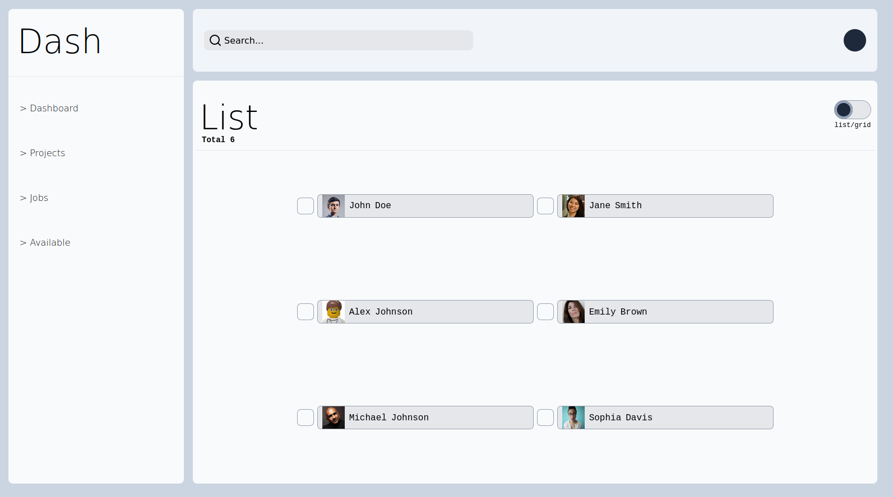

<br />
<div align="center">

<h3 align="center">Model Dashboard</h3>

  <p align="center">
  A dashboard for searching and assigning jobs to people.
  </p>

<a style="font-size: 18px;" href="https://kimjacobus.github.io/dashboard/">See the app live</a> 🚀
<br/>
<br/>


</div>

## About The Project

**A dashboard designed to seamlessly manage project allocation among diverse models**
made with a functional and clean looking UI, enhanced with animation to elevate the experience.

There are two viewing modes: the grid view for precise individual selections, and the list view for efficient bulk selections.
Searching for specific people is done by using the search modal which functions via preset filters or the search input.

The projects tab enables users to generate new projects, access existing ones, and see who's assigned.
While the project remains a work in progress, the foundational components are firmly in place. I've also plugged in some fake data and a local filter function to mirror the database data and the graphQL functions for the time being.

### Built With

[![React][React.js]][React-url]
[![Tailwind][Tailwind]][Tailwind-url]
[![NodeJS][NodeJS]][NodeJS-url]
[![Express][Express]][Express-url]
[![GraphQL][GraphQL]][Tailwind-url]
[![MongoDB][MongoDB]][Tailwind-url]
[![Vite][Vite]][Vite-url]
[![Prettier][Prettier]][Prettier-url]
[![ESlint][ESlint]][ESlint-url]

## Getting Started

Instructions for running the project locally.

### Prerequisites

-   npm (or the package manager your prefer)

    ```sh
    npm install npm@latest -g
    ```

### Installation

1. Clone the repo
    ```sh
    git clone https://github.com/KimJacobus/dashboard.git
    ```
2. Cd into the folder that has the package.json file then install the NPM packages
    ```sh
    npm install
    ```
3. Run the local client
    ```sh
    npm run dev
    ```

## Dependencies used

-   [gsap](https://greensock.com/gsap/)
-   [gh-pages](https://github.com/tschaub/gh-pages)

## Contact

jacobus.kim@gmail.com

<p align="right">(<a href="#readme-top">back to top</a>)</p>

[React.js]: https://img.shields.io/badge/React-20232A?style=for-the-badge&logo=react&logoColor=61DAFB
[React-url]: https://reactjs.org/
[Vite]: https://img.shields.io/badge/Vite-20232A?style=for-the-badge&logo=vite&logoColor=c061cb
[Vite-url]: https://vitejs.dev/
[Tailwind]: https://img.shields.io/badge/Tailwind-20232A?style=for-the-badge&logo=Tailwind&logoColor
[Tailwind-url]: https://tailwindcss.com/
[NodeJS]: https://img.shields.io/badge/NodeJS-20232A?style=for-the-badge&logo=NodeJS&logoColor
[NodeJS-url]: https://tailwindcss.com/
[Express]: https://img.shields.io/badge/Express-20232A?style=for-the-badge&logo=Express&logoColor
[Express-url]: https://expressjs.com/
[GraphQL]: https://img.shields.io/badge/GraphQL-20232A?style=for-the-badge&logo=GraphQL&logoColor
[GraphQL-url]: https://graphql.org/
[MongoDB]: https://img.shields.io/badge/MongoDB-20232A?style=for-the-badge&logo=MongoDB&logoColor
[MongoDB-url]: https://www.mongodb.com/
[Prettier]: https://img.shields.io/badge/prettier-20232A?style=for-the-badge&logo=prettier&logoColor
[Prettier-url]: https://prettier.io/
[ESlint]: https://img.shields.io/badge/eslint-20232A?style=for-the-badge&logo=eslint&logoColor
[ESlint-url]: https://eslint.org/1
